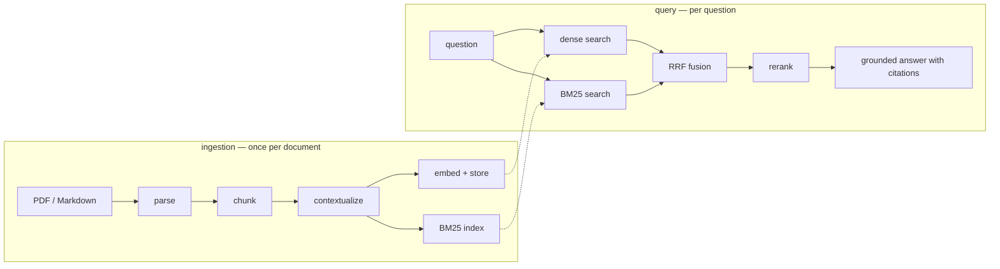

# How it works — starting from zero

This page assumes you can code but have never built a RAG system. It builds
every idea from the ground up, with real inputs and outputs at each step, and
ends at the design of this library. If you already know RAG, skim to
[the fix](#the-fix-a-sticky-note-on-every-chunk) and go deeper in
[costs.md](costs.md) and [caching.md](caching.md).

The technique implemented is
[Contextual Retrieval](https://www.anthropic.com/news/contextual-retrieval),
published by Anthropic (see also their
[cookbook](https://platform.claude.com/cookbook/capabilities-contextual-embeddings-guide)).
The engineering around it — excerpt mode, tiered PDF parsing, cache-aware
concurrency, the retrieval trace — is this package's own.

## First: what RAG actually is

A language model doesn't know your documents. It knows what it was trained on,
which does not include last quarter's report or your contracts. RAG
(retrieval-augmented generation) is the standard fix, and the idea is almost
disappointingly simple:

1. When a user asks a question, **find** the few passages in your documents
   most likely to contain the answer.
2. **Paste** those passages into the prompt.
3. Ask the model to answer **using only those passages**, citing them.

The model never "learns" your documents; it reads a handful of relevant
excerpts at question time, like an open-book exam.

Why not paste *everything* into the prompt? Three reasons: documents outgrow
context windows fast; you'd pay to send your whole corpus with every question;
and models get measurably worse at using information buried in a huge pile of
mostly-irrelevant text. So everything depends on step 1 — **retrieval**. If the
right passage isn't found, the best model in the world answers from the wrong
material. Retrieval quality is the ceiling on answer quality, and this whole
library is about raising that ceiling.

## Chunking: the necessary crime

You can't retrieve "the relevant part of a document" without first deciding
what a *part* is. So documents get cut into **chunks** — passages of a few
hundred tokens, small enough to embed and paste into prompts. Here's a real
document and what chunking does to it:

```markdown
# Borealis Industries — Q2 2025 Quarterly Report

## Business overview
Borealis closed Q2 2025 in line with plan...

## Revenue
Total revenue grew 14% year over year, reaching $595 million
for the quarter, driven by subscription renewals...

## Operating margin
Operating margin came in at 22% for the quarter, reflecting...
```

becomes, roughly:

```
chunk 0  [section: (title)]            "# Borealis Industries — Q2 2025..."
chunk 1  [section: Business overview]  "Borealis closed Q2 2025 in line..."
chunk 2  [section: Revenue]            "Total revenue grew 14% year over..."
chunk 3  [section: Operating margin]   "Operating margin came in at 22%..."
```

This library's chunker cuts along real structure, in order of preference:
headings, then paragraphs, then sentences, with hard character cuts only inside
a single giant sentence. Four block types are **atomic** and never split, even
oversized — fenced code, display math, Markdown pipe tables, HTML tables —
because a torn formula or table row is worse than a big chunk. A small
sentence-snapped overlap is carried between neighboring chunks so a sentence
straddling a boundary survives somewhere whole. Every chunk keeps provenance:
which document, which pages, which heading trail — that's what makes citations
possible later.

Two properties matter downstream: **nothing is lost** (every character of the
source lands in exactly one chunk, so the ordered chunk list *is* the
document), and the cutting is deliberately unfancy — the retrieval gains in
this library come from the next steps, not from a cleverer knife.

## How a chunk gets found

Two search mechanisms, with opposite personalities. Real systems run both.

**Embeddings — search by meaning.** An embedding model turns text into a long
list of numbers (a vector) arranged so that texts with similar *meaning* get
similar numbers. "Revenue grew 14%" and "sales climbed by double digits" land
near each other; "the printer is jammed" lands far away. Index every chunk's
vector once; at question time, embed the question and take the nearest chunks.
This is **dense retrieval**. It's superb at paraphrase (the user never has to
guess the document's exact words) and even works across languages. Its
weakness: it's blurry on exact strings — product codes, error IDs, names.

**BM25 — search by exact words.** The classic keyword scorer behind decades of
search engines. It rewards chunks containing the question's rare words: if only
three chunks in your corpus mention "TS-1129", a query containing "TS-1129"
finds them instantly. Exact where embeddings are blurry; blind to synonyms
where embeddings shine.

| | Dense (embeddings) | BM25 (keywords) |
|---|---|---|
| "sales climbed" finds "revenue grew" | yes | no |
| "error TS-1129" finds that exact code | shaky | dead on |
| Works across languages | often | no |
| Needs a server / GPU | no (here: embedded Chroma) | no (here: pure Python) |

They fail so differently that combining them (§ hybrid, below) beats either
alone. But notice what they *share*: **both can only work with the text the
chunk actually contains.** Hold that thought.

## Where it all breaks down

Look at chunk 2 again, exactly as the index sees it:

> "Total revenue grew 14% year over year, reaching $595 million for the
> quarter, driven by subscription renewals..."

Now the user asks: *"How much did Borealis Industries' revenue grow in Q2
2025?"*

That chunk is the answer. But as written it contains neither "Borealis" nor
"Q2 2025" — the document said those once, on the title line, three chunks
away. The embedding of this chunk has no Borealis in it to be near; BM25 has no
"Borealis" token to match. Both retrievers are blind to it, *for the same
reason*. And if your corpus holds twelve companies' quarterly reports, it
contains twelve interchangeable revenue chunks, and retrieval degenerates into
a coin toss among them.

This isn't a corner case — it's the normal condition of real documents, which
state their identity once and then say "the Company", "the quarter", "the
patient" for fifty pages. Measured on exactly this corpus shape
([evaluation.md](evaluation.md)), plain hybrid retrieval finds a correct chunk
in its top-5 **2.8%** of the time. Not degraded — collapsed.

A quick test for your own corpus: pull ten random chunks and read them cold.
If a stranger couldn't tell what each one is about, you have this problem.

## The fix: a sticky note on every chunk

At ingestion — once per chunk, before anything is indexed — show an LLM the
*whole document* and the chunk, and ask for one or two sentences situating the
chunk within the document. This library uses Anthropic's published prompt
verbatim:

```
<document>
{THE WHOLE DOCUMENT}
</document>

Here is the chunk we want to situate within the whole document:
<chunk>{THE CHUNK}</chunk>

Please give a short succinct context to situate this chunk within
the overall document for the purposes of improving search retrieval
of the chunk. Answer only with the succinct context and nothing else.
```

The model — which *has* read the title line — writes something like:

> *This chunk is from Borealis Industries' Q2 2025 quarterly report, in the
> Revenue section covering year-over-year growth.*

That blurb gets **prepended to the chunk for indexing only**. Before and after,
from the index's point of view:

| | What the embedding & BM25 index see |
|---|---|
| Plain | "Total revenue grew 14% year over year, reaching $595 million..." |
| Contextual | "**This chunk is from Borealis Industries' Q2 2025 quarterly report, in the Revenue section...**\n\nTotal revenue grew 14% year over year, reaching $595 million..." |

Now the Borealis-Q2 question has something to grip: the embedding lands near
it, and BM25 matches "Borealis" as a literal token. One LLM call repaired the
shared blind spot. Note what the technique is *not*: not a smarter chunker (the
chunks are unchanged), not a bigger context window (the answer model sees the
same chunks it always did). It's metadata enrichment at indexing time, written
by the one component that has actually read the whole document.

### Indexed vs. cited — the honesty rule

The blurb exists **for finding, not for reading**. One decision, stated once,
and every stage inherits it:

| | Sees blurb + chunk | Sees original chunk only |
|---|---|---|
| Embedding | ✅ | |
| BM25 index | ✅ | |
| Reranker | ✅ | |
| Answer generation | | ✅ |
| Citations shown to the user | | ✅ |

Why so strict? The blurb is *generated text* — usually right, but a model's
paraphrase, not the source. Letting it leak into answers or citations would
mean quoting the model to the user while claiming to quote the document.
Index-only gives you the findability without ever polluting provenance.

## The money question

"An LLM call per chunk, each resending the whole document" sounds ruinous. It
isn't, because of prompt caching — the document rides at the *start* of every
prompt, byte-identical, so providers bill it in full once and at ~10% for
every other chunk of that document. For a realistic 100-document, 3,000-chunk
corpus: **~$0.20** to ingest plain, **~$2.30** contextual with caching (~$12
without). Query-time cost and latency are **identical** to plain RAG — the
premium is one-time.

The full worked math, and the honest list of cases where plain RAG is the
better call, are in **[costs.md](costs.md)**. How caching works on OpenAI,
Azure OpenAI, and Anthropic — and how to verify it's actually engaging — is
**[caching.md](caching.md)**. Both are short; read them before ingesting a
large corpus.

## The pipeline



You've now seen parse-chunk-contextualize. The query side has three ideas left.

### Hybrid search and rank fusion

Both retrievers see every query. Merging their results raises a trap: a cosine
similarity of 0.83 and a BM25 score of 7.1 live on incomparable scales —
adding or averaging them is numerology. So the merge ignores scores entirely
and uses **ranks** — Reciprocal Rank Fusion. Each chunk earns
`1 / (60 + rank)` from every list it appears in:

```
chunk ranked 1st by dense, 3rd by BM25:
  1/(60+1) + 1/(60+3) = 0.0323     ← liked by both: rises
chunk ranked 1st by dense only:
  1/(60+1)            = 0.0164     ← loved by one: beaten
```

A chunk both retrievers liked outranks a chunk either loved alone — the
behavior you want, given how differently they fail. (The 60 softens the top
ranks' dominance; it's the standard constant, nobody tunes it.)

One deflationary note from measurement: hybrid is a *refinement*, not the
rescue. On the benchmark corpus, plain-chunk hybrid still scores ~0% — BM25
matches the company name only in title chunks, which have the name but not the
metric, and fusion faithfully inherits the confusion. The blurb is what makes
hybrid worth having.

### Reranking: similarity is not relevance

After fusion, the top candidates for a Borealis-Q2-revenue question typically
include Borealis Q1's revenue section and Borealis Q2's margin section — all
*near* the query, only one *answers* it. A *reranker* reads the query and the
candidates together and reorders by answer-likelihood: here, one cheap listwise
LLM call over the top ~30 fused candidates (`llm` mode), a hosted cross-encoder
(`endpoint` mode), or nothing (`off`).

The hard-won detail: the reranker is shown **blurb + chunk**, never the bare
chunk. An early version showed bare chunks and the reranker made results
*worse* (Pass@5 fell 94% → 81%) — out-of-context chunks are as
indistinguishable to a reranker as they were to the retrievers, so it
confidently reshuffled twelve identical-looking revenue chunks. Shown the
contextual text, the same reranker became the best stage in the pipeline
(Pass@1 91.7%). The general lesson: every stage that judges a chunk needs the
chunk's context to judge it.

The implementation is also defensive: LLM rerankers garble indices and forget
candidates, so invalid indices are dropped and forgotten candidates re-appended
in original order — a flaky reranker can reorder results but never lose one.
It's skipped automatically when the candidate pool already fits in `k`.

### Grounded answering

The generator gets numbered sources — original chunk text only, per the
honesty rule — under a contract: use only these, cite inline as `[S1]`, say
plainly when the sources don't contain the answer, answer in the question's
language. Each `[S#]` resolves through the chunk's provenance to a document
and page.

The contract matters most when retrieval *fails*. From the benchmark, the same
question to both pipelines:

> **Plain:** "The provided sources do not include Borealis Industries' revenue
> figures for Q2 2025, so I can't determine how much revenue grew from them
> alone. [S1] [S3]"
>
> **Contextual:** "Borealis Industries' total revenue grew **14% year over
> year** in Q2 2025, reaching **$595 million** for the quarter [S2]."

The plain pipeline retrieved wrong chunks and **refused rather than
hallucinated** — retrieval quality and answer honesty are separate systems,
and you want both.

### When the document doesn't fit: excerpt mode

The published recipe assumes the whole document fits the model's input window;
a 500k-token filing doesn't, and blurb quality degrades with irrelevant bulk
well before hard limits. Documents over `CONTEXT_DOC_CAP` are handled
automatically with a purpose-built excerpt per batch of chunks:

```
excerpt = document HEAD (~6k tokens: title, TOC, intro — its identity)
        + "[…]"
        + the REGION around the chunk (± ~4k-token margins)
```

The head preserves exactly what the orphaned-chunk problem is about — the
document's identity — and consecutive chunks are batched (snapped to top-level
sections) so each batch shares one byte-identical excerpt and prefix caching
keeps working per batch. The prompt honestly says `<document_excerpt>`.
Documents under the cap get the published recipe untouched.

## The architecture, without vocabulary

Fourteen small modules, but only three boundaries you need to hold in your
head — each exists so something can be swapped without touching the rest:

1. **The endpoint seam** (`llm.py`) — the only file that imports the OpenAI
   SDK. Everything else calls `llm.chat` / `llm.embed` / `llm.transcribe_image`.
   Point the whole package at any OpenAI-compatible endpoint with one env var;
   fake the whole package in tests by patching two functions — that's exactly
   how the offline test suite and `examples/offline_demo.py` run with no key.
2. **The retriever contract** (`ScoredChunk` + ranked-id lists) — a retriever
   is anything that produces a ranking and joins the RRF fusion. A knowledge
   graph or SQL retriever slots in next to dense and BM25 with no downstream
   changes.
3. **The parser contract** (`ParsedDoc`) — any parser returning per-page
   Markdown plugs into the same `ingest_pdf` path; the vision parser and Azure
   Document Intelligence are both just backends behind it.

Data flows one way — ingestion: `parse → chunk → contextualize → embed +
store`; query: `embed ‖ BM25 → fuse → rerank → answer` — and each stage
communicates only through the shared types in `types.py`. If you want to watch
the flow with your own eyes, `rag.search_trace()` returns every intermediate
stage of a real query, and `examples/offline_demo.py` prints the whole journey
without needing a key.

## Design decisions, condensed

| Decision | Why |
|---|---|
| Blurbs indexed, originals cited | Findability without polluting answers or provenance |
| Document-first prompt | Prefix caching pays for the technique ([caching.md](caching.md)) |
| First call per prefix runs alone | Prime the cache once, not N times in parallel |
| Excerpt mode over truncation | Huge docs keep head *identity* + local context, and caching |
| Atomic blocks never split | A torn formula/table is worse than an oversized chunk |
| RRF over score mixing | BM25 and cosine scales are incomparable; ranks aren't |
| Reranker sees contextual text | An ambiguous chunk misleads the reranker too (measured) |
| Pure-Python BM25 | Sub-ms at corpus scale; a search server earns nothing here |
| Lazy settings | A library must import without credentials |
| Chroma embedded | No infra to run; swap via the `VectorStore` seam if you outgrow it |
