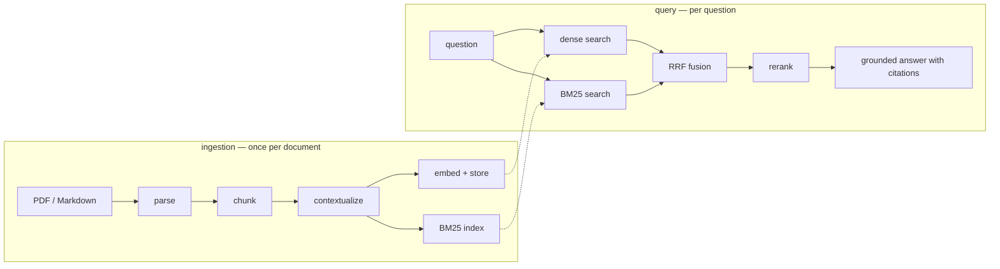

# How it works

This document explains the pipeline stage by stage — what each one does, why
it exists, and the design decisions behind it. The technique implemented is
[Contextual Retrieval](https://www.anthropic.com/news/contextual-retrieval),
published by Anthropic (see also their
[official cookbook](https://platform.claude.com/cookbook/capabilities-contextual-embeddings-guide));
the engineering around it — excerpt mode, tiered PDF parsing, cache-aware
concurrency, the trace — is this package's own.

## The problem

Chunk a real document and most chunks stop making sense on their own:

> *"Revenue grew 12% year over year, reaching $840 million for the quarter."*

Whose revenue? Which quarter? The document knew; the chunk doesn't. Embeddings
and BM25 both index the chunk *as written*, so a query naming the company and
quarter has almost nothing to grip. This is not a corner case — it is the
normal condition of financial filings, contracts, and papers, and it is
measurable: in [our benchmark](evaluation.md), plain hybrid retrieval
collapses to **~0–3%** Pass@5 on exactly this corpus shape.

## The fix

Before indexing, an LLM writes a one-to-two-sentence blurb situating each
chunk within its parent document:

> *"This chunk is from Borealis Industries' Q2 2025 quarterly report, in the
> Revenue section covering year-over-year growth."*

The blurb is prepended to the chunk **for indexing only** — both the embedding
and the BM25 index see `blurb + chunk`, while the answer generator and the
citations always use the original chunk text. One decision, stated once, and
every downstream stage inherits it:

| | Sees blurb + chunk | Sees original chunk only |
|---|---|---|
| Embedding | ✅ | |
| BM25 index | ✅ | |
| Reranker | ✅ | |
| Answer generation | | ✅ |
| Citations shown to the user | | ✅ |

## The pipeline



### 1. Parsing (optional) — `parsing/`

PDF pages are routed individually to the cheapest safe path:

- **text route** (free): only when the page is confidently clean prose — a
  legible text layer, no math/table signal, no images or vector drawings.
- **vision route**: everything else. The page is rendered to an image
  (pypdfium2, local, light) and a vision LLM transcribes it to Markdown with
  LaTeX formulas — and *extracts* figures (axis labels, trends, node/arrow
  relationships) rather than just labeling them.

The routing is per page and automatic; a page mixing prose with one chart goes
to vision so the chart is never silently dropped. Azure Document Intelligence
is available as a deterministic, in-tenant alternative behind the same
`parse_document()` seam.

### 2. Chunking — `chunker.py`

Cuts on real structure, in order of preference: headings → paragraphs →
sentences → (only for a single giant sentence) hard character cuts. Four
block types are **atomic** and never split, even oversized: fenced code,
display math, Markdown pipe tables, HTML tables — a torn formula or table row
is worse than a big chunk.
~512-token targets, a sentence-snapped ~64-token overlap so boundary sentences
survive, and provenance (doc, pages, heading trail) on every chunk.

Two properties matter downstream:

- **Nothing is lost**: every character of the source lands in a chunk, so the
  ordered chunk list *is* the document — excerpt mode (below) depends on this.
- **Semantic chunking is deliberately absent**: slower, not consistently
  better. The cut is low-leverage; the gains come from contextualization.

### 3. Contextualization — `contextual.py`

One chat call per chunk, at temperature 0, using Anthropic's published prompt
with the document placed **first**:

```
<document>
{document}
</document>

Here is the chunk we want to situate within the whole document:
<chunk>{chunk}</chunk>
...
```

Document-first ordering is not cosmetic — it is the economics. The prompt
prefix is byte-identical across all chunks of a document, so the provider's
automatic prompt-prefix cache serves it at ~10% price from the second call on.
Measured here (gpt-5.4-mini): **82% of prompt tokens cached** per steady-state
call. Three engineering details:

- **Cache-priming concurrency.** The first call of each document runs *alone*
  (it writes the cache entry); only then does a small thread pool fan out.
  Parallelizing the first call would make every worker pay the full uncached
  prefix simultaneously.
- **Blurb hygiene.** Models sometimes disobey "answer only with the context"
  and prepend "Here is the context:" or wrap the blurb in quotes. That noise
  would be *embedded*, so it is stripped before indexing.
- **Verifiability.** Every ingestion report carries `cached_tokens`, so a
  caching regression is visible instead of silently multiplying costs.

#### Excerpt mode — when the document doesn't fit

The published recipe assumes the whole document fits the model's input
window. A 500k-token filing doesn't — and even below hard limits, blurb
quality degrades as irrelevant bulk grows ("context rot"). Documents over
`CONTEXT_DOC_CAP` are handled automatically:

```
excerpt = document HEAD (~6k tokens: title, TOC, intro — the document's identity)
        + "[…]"
        + the REGION around the chunk (± ~4k-token margins)
```

Consecutive chunks are batched — snapping batch boundaries to top-level
sections — so each batch shares one byte-identical excerpt and prefix caching
keeps working *per batch* exactly as it does per document. The prompt swaps
`<document>` for `<document_excerpt>` and says honestly that the model is
seeing the beginning plus the surrounding part. Documents under the cap get
the published recipe untouched.

### 4. Storage — `store.py`

Chroma, embedded and on-disk: no server, no GPU, one collection per corpus.
Per chunk: the **embedding of `blurb + chunk`**, the **original text** as the
document, and `{context, doc_id, pages, section}` as metadata. Ingestion is an
atomic per-document `upsert`, which is what makes bulk ingestion resumable
(`doc_ids()` tells you what's already fully in).

### 5. Hybrid search — `bm25.py`, `search.py`, `index_cache.py`

Two retrievers see every query:

- **Dense** — cosine similarity over the contextual embeddings. Strong on
  paraphrase and cross-lingual matching; blurry on exact terms.
- **BM25** — pure-Python Okapi BM25 over the same contextual text. Exact on
  identifiers, error codes, accented vocabulary; blind to synonyms. At
  thousands-of-chunks scale a full scoring pass is sub-millisecond, which is
  why there is no search server to operate.

Their score scales are incomparable, so fusion is **rank-based** — Reciprocal
Rank Fusion: each chunk scores `Σ 1/(60 + rank)` across the lists it appears
in. A chunk both retrievers liked rises above one either loved alone.

The corpus records and BM25 index are cached per collection and invalidated on
writes (plus a collection-count re-check that catches size-changing writes
from *other* processes; a same-count upsert from another process is the one
case it cannot see — documented in `index_cache.py`) — queries never pay a
rebuild. Cached records are treated as immutable templates; per-query scores
are stamped onto copies.

### 6. Reranking — `rerank.py`

Similarity is not relevance. The reranker reads query and candidates together
and reorders by *how well each passage answers the question*:

- **`llm`** (default): RankGPT-style — one chat call ranks the top ~30 fused
  candidates. No extra service.
- **`endpoint`**: a hosted cross-encoder (Cohere/Jina request shape).
- **`off`**: pass-through.

Two hard-won details. First, the reranker is shown **blurb + chunk**, not the
bare chunk — an out-of-context chunk is ambiguous to a reranker for the same
reason it was ambiguous to the retrievers; measured on our benchmark,
reranking bare chunks *hurt* (P@5 94%→81% on an earlier corpus revision)
while reranking contextual text made the reranker the best condition
(P@1 91.7%, P@5 97.2%). Second, the rerank is defensive: indices the model garbles are dropped,
candidates it forgot are appended in original order — a flaky reranker can
reorder results but never lose them. It is also skipped when the candidate
pool already fits in `k` (it could only reorder, not select).

### 7. Grounded answering — `answer.py`

The generator gets numbered sources and a contract: use only these, cite
inline as `[S1]`, say plainly when the sources don't contain the answer,
answer in the question's language. Each `[S#]` maps to a `ScoredChunk` whose
`citation` resolves to document + pages — every claim is checkable. In the
benchmark, the plain-retrieval pipeline *correctly refuses* to invent numbers
its sources don't contain, while the contextual pipeline answers with the
right figure and citation: the grounding contract holding under both failure
and success.

## The seams (how to extend it)

The package is organized around three deliberate seams:

1. **The endpoint seam** (`llm.py`) — the only file importing the OpenAI SDK.
   Everything else calls `llm.chat` / `llm.embed` / `llm.transcribe_image`.
   Swap providers with one env var; fake the whole package in tests by
   patching two functions.
2. **The retriever contract** (`types.ScoredChunk` + ranked-id lists) — a new
   retriever (knowledge graph, SQL, an API) produces a ranking and joins the
   RRF fusion. Nothing downstream changes.
3. **The parser contract** (`parsing.ParsedDoc`) — any parser returning
   per-page Markdown plugs into the same `ingest_pdf` path.

## Design decisions, condensed

| Decision | Why |
|---|---|
| Blurbs indexed, originals cited | Findability without polluting answers or provenance |
| Document-first prompt | Prefix caching pays for the technique |
| First call per prefix runs alone | Prime the cache once, not N times in parallel |
| Excerpt mode over truncation | Huge docs keep head *identity* + local context, and caching |
| Atomic blocks never split | A torn formula/table is worse than an oversized chunk |
| RRF over score mixing | BM25 and cosine scales are incomparable; ranks aren't |
| Reranker sees contextual text | An ambiguous chunk misleads the reranker too (measured) |
| Pure-Python BM25 | Sub-ms at corpus scale; a search server earns nothing here |
| Lazy settings | A library must import without credentials |
| Chroma embedded | No infra to run; swap via the `VectorStore` seam if you outgrow it |
